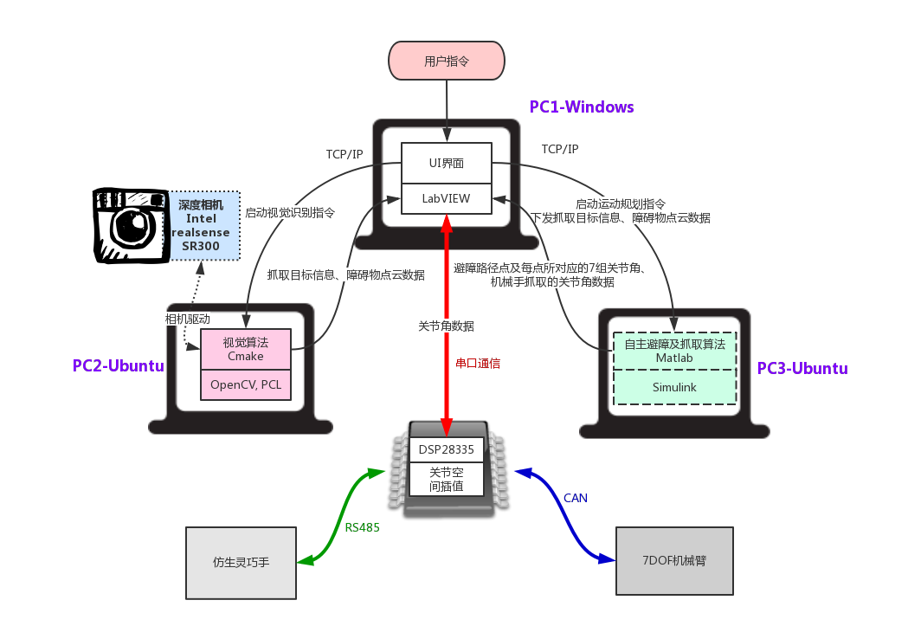
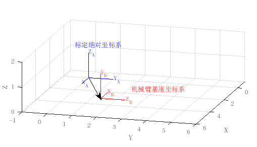
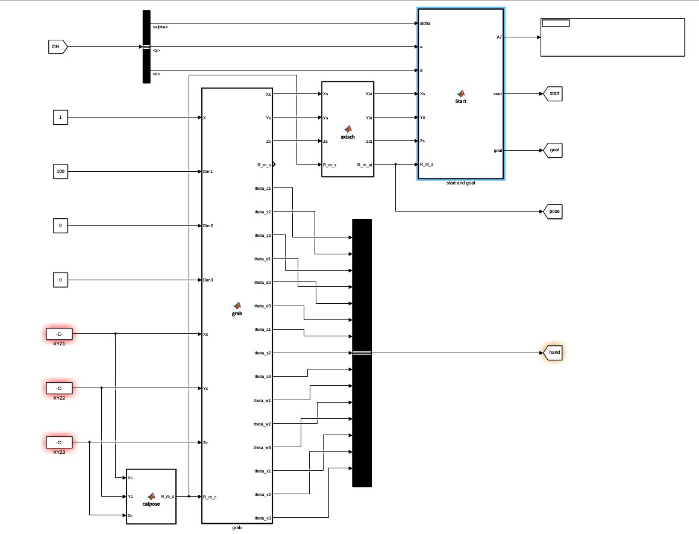
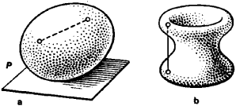
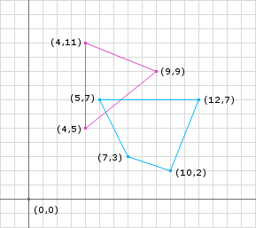

<!-- ---
documentclass:
    - ctexart
--- -->

<!-- @import "[TOC]" {cmd="toc" depthFrom=1 depthTo=6 orderedList=false} -->

<!-- code_chunk_output -->

* [自主避障算法报告](#自主避障算法报告)
	* [1. 算法概述](#1-算法概述)
		* [1.1 系统框架](#11-系统框架)
		* [1.2 算法流程](#12-算法流程)
		* [1.3 运行说明](#13-运行说明)
	* [2. 机械臂与三维场景建模](#2-机械臂与三维场景建模)
		* [2.1 机械臂建模](#21-机械臂建模)
		* [2.2 三维场景建模](#22-三维场景建模)
		* [2.3 抓取姿态计算](#23-抓取姿态计算)
	* [3. 碰撞检测方法](#3-碰撞检测方法)
		* [3.1 算法原理](#31-算法原理)
			* [3.1.1 SAT分离轴理论](#311-sat分离轴理论httpsblogcsdnnetu011373710articledetails54773171)
			* [3.1.2 GJK算法](#312-gjk算法httpsblogcsdnnetu011373710articledetails54773174)
		* [3.2 算法实现](#32-算法实现)
	* [4. RRT路径规划](#4-rrt路径规划)
		* [4.1 算法原理](#41-算法原理1)
		* [4.2 RRT算法流程](#42-rrt算法流程)
		* [4.3 算法实现](#43-算法实现2)
	* [5. 数值仿真实现](#5-数值仿真实现)
	* [6. TODO lists](#6-todo-lists)
	* [参考文献](#参考文献)

<!-- /code_chunk_output -->

# 自主避障算法报告

## 1. 算法概述

### 1.1 系统框架
基于视觉的自主避障抓取系统主要硬件组成包括：3台个人电脑、1个Intel realsense深度相机、1个主芯片为DSP28335型号的控制开发板，机械本体包括1个7自由度冗余机械臂（暂无）和1个仿生机械灵巧手（暂无）。其中1台电脑作为主上位机（Windows系统），主要运行Labview编写的人机交互界面，负责下发用户指令、传递分发数据以及仿真动画演示。其它两台电脑为Linux系统，分别运行视觉算法和自主避障及抓取算法。三台电脑之间均采用TCP/IP通信，主上位机与DSP控制板采用串口通信。DSP控制板负责机械臂7组关节角的关节空间插值规划，并将插值后的关节角数据实时发送机械臂，同时发送回上位机作同步仿真动画演示。总体系统框架如下图1.1所示，本报告主要内容为自主避障算法部分的研究。
<center>


图1.1 系统框架图
</center>

### 1.2 算法流程
- 算法的输入：深度相机采集的抓取目标的信息（包括目标物点云数据、质心位置），三维场景中的障碍物点云数据、机械臂初始状态及安装位置。
- 算法的输出：从初始位置到抓取位置的一组避障路径点及每个路径点对应的机械臂7组关节角数据。

自主避障算法由四大部分组成：1.机械臂与三维场景建模；2.机械臂与障碍物的碰撞检测；3.机械臂的运动学正反解；4.基于随机空间采样的RRTstar路径规划。 其详细的算法流程图如下图1.2所示：
<center>


图1.2 算法流程图
</center>

### 1.3 运行说明

1. 配置运行环境：
(1) 安装Matlab 64bit /Simulink。
(2) 需要安装[Robotics Toolbox for matlab](http://petercorke.com/wordpress/toolboxes/robotics-toolbox)机器人开发工具包，可点击蓝色连接到网站下载相应安装文件。

2. 代码文件夹包含以下文件和函数：

列表 | 文件名 | 文件描述 | 文件类型
------------ | ------------ | ------------- | -----------
1 | demomain_connect_si2016.m | 与上位机建立Tcpip连接，接收视觉数据；调用各函数及simulink算法文件；画图及显示动画 | 主文件
2 | Motion_planning_simple_final2016_rere.slx | 自主避障算法的主体部分，为了后期做嵌入式代码生成，写成simulink形式 | simulink
3 | parameters.m | 设定机械臂DH参数、外形尺寸参数，桌面描述的参数 | 函数
4 | arm.m | 输出机械臂的几何描述 | 函数
5 | readdatas.m | 读取处理视觉输入数据，将抓取目标的质心坐标、障碍物外包络点云坐标转换到机械臂安装坐标系下，输出障碍物的几何描述 | 函数
6 | tabletest.m | 输出三维环境中桌面的几何描述 | 函数
7 | recv.txt | 存档的视觉输入数据，包括目标物质心坐标、物体类型、外形尺寸、点云数据，以及障碍物点云数据 | 数据

3.  函数调用关系

<center>


图1.3 函数调用图
</center>


## 2. 机械臂与三维场景建模

### 2.1 机械臂建模
- 建立机械臂模型，首先必须给出DH参数，冗余机械臂的7轴坐标系关系如下图2.1所示：
<center>


图2.1 三维场景及机械臂建模
</center>

- 输入机械臂的DH参数，外形尺寸参数（包括基座、机械臂、机械手），长度单位均为mm。

```matlab{.line-numbers}
%% 输入参数
%
function parameters(goal_XYZ)

delete DH.mat arm.mat sence.mat

%% DH_Parameters 机械臂的DH参数

deg=pi/180;  %定义单位

% theta=[0  0  0  0  0  0  0]*deg;   %初始关节角

alpha=[-90   90  -90   90  -90  90  0]*deg;

a=[ 0   0   0   0   0   0  0];

d=[60  0  300  0  280  0  100]; % Dbs=60mm; Dse=300mm; Dew=280mm; Dwt=100mm

DH=struct('d', d, 'a', a, 'alpha', alpha);

save DH.mat DH

%% Arm_Parameters

C_Base=struct('Coordinate', [0 0 -10], 'L', 60, 'W', 60, 'H', 20);  %基座描述为长方形，给出长宽高

C_Arm =struct('Coordinate', [0 0 0], 'R', 30, 'H',[]);  %机械臂描述为圆柱体，给出半径和高

C_Hand=struct('Coordinate', [0 0 0], 'R', 50, 'H',[]);  %机械手描述半圆柱体，给出半径和高

save arm.mat C_Base C_Arm C_Hand

%% Sence_Parameters

% CU =struct('Coordinate', [180  0  20], 'L', 35, 'W', 292, 'H', 210);

% CU2=struct('Coordinate', [200 -150 -330], 'L', 600, 'W', 600, 'H', 400);

% CU3=struct('Coordinate', [368 -120 -40], 'L', 245, 'W', 28, 'H', 105);

% CY=struct('Coordinate', [65 -280 -100], 'R', 35, 'H', 260);

% 抓取目标的质心位置,抓取物体描述为球体，给出半径
SP=struct('Coordinate', [goal_XYZ(1) goal_XYZ(2) goal_XYZ(3)], 'R', 50);

save sence.mat SP  % CU CU2 CU3 CY

end
```

- 机械臂几何模型

```matlab{.line-numbers}
%% ----机械臂几何模型----
%
function [Base,Arm1,Arm2,Arm3,Arm4,Arm5,Arm6,Arm7]=arm(DH,q,C_Base,C_Arm,C_Hand)

% 关节角
% deg=pi/180;
% q=[0 0 0 0 0 0 0]*deg;

% Link类函数
for i=1:7
    L(i)=Link('d', DH.d(i), 'a', DH.a(i), 'alpha', DH.alpha(i));
end

L1=L(1);
L2=L(2);
L3=L(3);
L4=L(4);
L5=L(5);
L6=L(6);
L7=L(7);

%---cylinder 生成圆柱体数据
% n=20;[x,y,z]=cylinder(1,n);
[z,r]=ndgrid([0 1],2*pi*(0:0.05:1)); n=size(z,2)-1;
x=cos(r);
y=sin(r);

X0=[zeros(1,n+1);x;zeros(1,n+1)];
Y0=[zeros(1,n+1);y;zeros(1,n+1)];
Z0=[z(1,:);z;z(2,:)];

%---cylinder 生成半圆柱体数据
% n=20;[x,y,z]=cylinder(1,n);
[z,r]=ndgrid([0 1],1*pi*(-0.5:0.05:0.5)); n=size(z,2)-1;
x=cos(r);
y=sin(r);

X0h=[zeros(1,n+1);x;zeros(1,n+1)];
Y0h=[zeros(1,n+1);y;zeros(1,n+1)];
Z0h=[z(1,:);z;z(2,:)];

%---机械臂外形尺寸
% C_Base,C_Arm,C_Hand

%---Cube_0 基座
Base=cube(C_Base.Coordinate(1),C_Base.Coordinate(2),C_Base.Coordinate(3),...
          C_Base.L,C_Base.W,C_Base.H);

%---cylinder_1
X=C_Arm.R*X0;
Y=C_Arm.R*Y0;
Z=L1.d*Z0;

L0=Link('d', 0,  'a', 0,  'alpha', 0);
T=L0.A(0);

[x1,y1,z1]=transform(X,Y,Z,T);
Arm1=cylind(x1,y1,z1);

%---cylinder_2
X=C_Arm.R*X0;
Y=C_Arm.R*Y0;
Z=80*Z0-40;

T=L1.A(q(1));

[x1,y1,z1]=transform(X,Y,Z,T);
Arm2=cylind2(x1,y1,z1);

%---cylinder_3
X=C_Arm.R*X0;
Y=C_Arm.R*Y0;
Z=L3.d*Z0;

T=L1.A(q(1))*L2.A(q(2));

[x2,y2,z2]=transform(X,Y,Z,T);
Arm3=cylind(x2,y2,z2);

%---cylinder_4
X=C_Arm.R*X0;
Y=C_Arm.R*Y0;
Z=80*Z0-40;

T=L1.A(q(1))*L2.A(q(2))*L3.A(q(3));

[x2,y2,z2]=transform(X,Y,Z,T);
Arm4=cylind2(x2,y2,z2);

%---cylinder_5
X=C_Arm.R*X0;
Y=C_Arm.R*Y0;
Z=L5.d*Z0;

T=L1.A(q(1))*L2.A(q(2))*L3.A(q(3))*L4.A(q(4));

[x3,y3,z3]=transform(X,Y,Z,T);
Arm5=cylind(x3,y3,z3);

%---cylinder_6
X=C_Arm.R*X0;
Y=C_Arm.R*Y0;
Z=80*Z0-40;

T=L1.A(q(1))*L2.A(q(2))*L3.A(q(3))*L4.A(q(4))*L5.A(q(5));

[x3,y3,z3]=transform(X,Y,Z,T);
Arm6=cylind2(x3,y3,z3);

%---cylinder_7
X=C_Hand.R*X0;
Y=C_Hand.R*Y0;
Z=L7.d*Z0;

T=L1.A(q(1))*L2.A(q(2))*L3.A(q(3))*L4.A(q(4))*L5.A(q(5))*L6.A(q(6));

[x4,y4,z4]=transform(X,Y,Z,T);
Arm7=cylind(x4,y4,z4);

%---plane---
% ezmesh('0',120)
% delete(get(gca,'title'))

end

%%
%---坐标变换
function [xt,yt,zt] = transform(x,y,z,T)
p1=[x(1,:);y(1,:);z(1,:)]; p1=T*p1;
p2=[x(2,:);y(2,:);z(2,:)]; p2=T*p2;
p3=[x(3,:);y(3,:);z(3,:)]; p3=T*p3;
p4=[x(4,:);y(4,:);z(4,:)]; p4=T*p4;

xt=[p1(1,:);p2(1,:);p3(1,:);p4(1,:)];
yt=[p1(2,:);p2(2,:);p3(2,:);p4(2,:)];
zt=[p1(3,:);p2(3,:);p3(3,:);p4(3,:)];
end

%---圆柱体1
function cyObj = cylind(x,y,z)
[TRI,V]= surf2patch(x,y,z);
cy.Vertices = V;
cy.Faces = TRI;
cy.FaceVertexCData = ones(size(V,1),1)*[0.80,0.30,0.10];   % parula
cy.FaceColor = 'interp';
cyObj = patch(cy,'LineStyle','none');
end

%---圆柱体2
function cyObj = cylind2(x,y,z)
[TRI,V]= surf2patch(x,y,z);
cy.Vertices = V;
cy.Faces = TRI;
cy.FaceVertexCData = flag(size(V,1));
cy.FaceColor = 'interp';
cyObj = patch(cy,'LineStyle','none');
end

%---cube---
function cbObj = cube(x0,y0,z0,a,b,c)
V1=[-1;  1;  1; -1; -1;  1;  1; -1;];
V2=[-1; -1;  1;  1; -1; -1;  1;  1;];
V3=[-1; -1; -1; -1;  1;  1;  1;  1;];
F= [1 2 3 4; 1 2 6 5; 2 3 7 6; 3 4 8 7; 4 1 5 8; 5 6 7 8;];

[THETA,PHI,~]=cart2sph(V1,V2,V3);
R=ones(size(V1(:,1)));
[V1,V2,V3]=sph2cart(THETA,PHI,R);
V=[a*V1+x0 b*V2+y0 c*V3+z0];

cb.Vertices = V;
cb.Faces = F;
cb.FaceVertexCData = bone(size(V,1));
cb.FaceColor = 'interp';
cbObj = patch(cb,'LineStyle','none'); % alpha(0.2)
end
```

### 2.2 三维场景建模
- 读取`recv.txt`中的数据，即从深度相机获取三维场景中障碍物的点云数据及抓取目标的质心位置信息。其中Dx=538; Dy=200; Dz=60;(Dx,Dy,Dz)为机械臂相对相机标定绝对坐标系的安装位置,如下图2.2所示。
<center>


图2.2 三维场景及机械臂建模
</center>

```matlab{.line-numbers}
%% ----3D环境模型----
%
function [goal,OBJdata]=readdatas(Dx,Dy,Dz)

data=load('recv.txt');

% if data(2)>0.18
%     fake=1;
% else
%     fake=0;
% end

numpoint=40; numobj=fix((size(data,2)-6)/(3*numpoint));

goal=1000*data(1:3);
goal=transform(goal,Dx,Dy,Dz); goal=goal';

% pose=data(4:6)';
% pose=[0, 50, 0];

if numobj>0

OBJJ=1*1000*reshape(data(7:end),3*numpoint,numobj)'; % delete(data);

% OBJ1=reshape(OBJJ(1,:),3,numpoint)'; OBJ1=transform(OBJ1,Dx,Dy,Dz);
% OBJ2=reshape(OBJJ(2,:),3,numpoint)'; OBJ2=transform(OBJ2,Dx,Dy,Dz);
% OBJ3=reshape(OBJJ(3,:),3,numpoint)'; OBJ3=transform(OBJ3,Dx,Dy,Dz);

OBJdata=cell(1,numobj);
for i=1:numobj
    OBJ=reshape(OBJJ(i,:),3,numpoint)';
    OBJ=transform(OBJ,Dx,Dy,Dz);
    OBJdata{i}=OBJ;
    mesh3(OBJ),hold on
end

elseif numobj==0
    OBJdata=cell(1);
    OBJdata{1}=zeros(numpoint,3);
end

OBJdata=cell2mat(OBJdata);

% figure(9);set(gcf,'position',[0 0 500 500]);
plot3(goal(1),goal(2),goal(3),'k','marker','.','markersize',20),hold on

% for ii=1:numpoint
% plot3(OBJ1(ii,1),OBJ1(ii,2),OBJ1(ii,3),'k','marker','.','markersize',6),hold on
% plot3(OBJ2(ii,1),OBJ2(ii,2),OBJ2(ii,3),'b','marker','.','markersize',6)
% plot3(OBJ3(ii,1),OBJ3(ii,2),OBJ3(ii,3),'m','marker','.','markersize',6)
% end

% mesh3(OBJ1),hold on
% mesh3(OBJ2)
% mesh3(OBJ3)

%---plane---
% [x,y]=meshgrid(-2000:100:2000);
% z = -(Dz+5)*ones(size(x,1));
% mesh(x,z,-y,'EdgeColor','k','FaceAlpha',0.6);

axis([-500 1000 -500 1000 -500 1000]); grid on
% xlabel('X');ylabel('Z');zlabel('-Y'); alpha(0.8); % lighting phong
axis off; view(180,0);

end

function obj=transform(OBJ,Dx,Dy,Dz)
X=OBJ(:,1); Y=OBJ(:,2); Z=OBJ(:,3);

X=Dx-X; Y=Dy-Y; Z=Z-Dz;
XX=X; YY=Z; ZZ=-Y;

obj(:,1)=XX; obj(:,2)=YY; obj(:,3)=ZZ;
end

function mesh3(OBJi)
x=OBJi(:,1);
y=OBJi(:,2);
z=OBJi(:,3);

dt=delaunayTriangulation(x,y,z);
Tes=dt(:,:);dX=[x(:) y(:) z(:)];
tetramesh(Tes,dX);
% camorbit(20,0)
end
```

### 2.3 抓取姿态计算
- 已知被抓取目标的质心位置信息，计算机械手预抓取的位置及抓取姿态信息。设定机械手工具坐标系$T$在中指基关节。
<center>


图2.3 抓取姿态计算
</center>

```matlab{.line-numbers}
%% 计算机械手工具坐标抓取姿态矩阵
function R_m_c = calpose(Xc,Yc,Zc)

Lst=[Xc;0;Zc];   % 计算目标物的质心坐标与机械臂安装原点的轴线Lst

Y0=[0;1;0];   % 设定抓取时机械手工具坐标系Y轴与机械臂安装坐标系Y轴平行

Z0=Lsw/normd(Lst); % 设定抓取时机械手工具坐标系Z轴与轴线Lst的Z轴一致

X0=cross(Y0,Z0)/normd(cross(Y0,Z0)); % 求出抓取时机械手工具坐标系X轴

R_m_c=[X0 Y0 Z0];

end

function d = normd(qt)
    d = sqrt((qt(1))^2 + (qt(2))^2 + (qt(3))^2);
end
```

- 计算机械臂腕关节的起点和终点

```matlab{.line-numbers}
%% Start and goal
%
function [A7, start, goal] = Start(alpha, a, d, Xs, Ys, Zs, R_m_s)

% 初始关节角
deg=pi/180;
theta_start=[90 0 0 120 180 0 0]*deg;

T1 = T_matrix(theta_start(1),alpha(1),a(1),d(1));
T2 = T_matrix(theta_start(2),alpha(2),a(2),d(2));
T3 = T_matrix(theta_start(3),alpha(3),a(3),d(3));
T4 = T_matrix(theta_start(4),alpha(4),a(4),d(4));
T5 = T_matrix(theta_start(5),alpha(5),a(5),d(5));
T6 = T_matrix(theta_start(6),alpha(6),a(6),d(6));
T7 = T_matrix(theta_start(7),alpha(7),a(7),d(7));

% start_腕关节位置
A7=T1*T2*T3*T4*T5*T6*T7;
Tw=A7*[0;0;-d(7);1];
start=Tw(1:3);

% goal_腕关节位置
% theta_goal=[0 0 0 0 pose(1) pose(2) pose(3)]*deg;

% M5 = T_matrix(theta_goal(5),alpha(5),a(5),d(5));
% M6 = T_matrix(theta_goal(6),alpha(6),a(6),d(6));
% M7 = T_matrix(theta_goal(7),alpha(7),a(7),d(7));

% rot = M5*M6*M7;
% rotmZYX = rot(1:3,1:3);
% MM=[rotmZYX goal_XYZ;[0 0 0 1]];

MM=[R_m_s [Xs;Ys;Zs];[0 0 0 1]];
Mw=MM*[0;0;-d(7);1];
goal=Mw(1:3)+ [0; 0; 0];

% input_腕关节位置
% goal=[526;-40;203];
% goala = goal_XYZ + [0; 80; 0];
% goalb = goal_XYZ + [0; 0; 0];

% if fake==1
%     goal=goala;
% else
%     goal=goalb;
% end
end

function  T = T_matrix( theta, alpha, ai, di )

    T=zeros(4,4);

    T(1,1)= cos(theta);
    T(1,2)= -sin(theta)*cos(alpha);
    T(1,3)= sin(theta)*sin(alpha);
    T(1,4)= ai*cos(theta);

    T(2,1)= sin(theta);
    T(2,2)= cos(theta)*cos(alpha);
    T(2,3)= -cos(theta)*sin(alpha);
    T(2,4)= ai*sin(theta);

    T(3,1)= 0;
    T(3,2)= sin(alpha);
    T(3,3)= cos(alpha);
    T(3,4)= di;

    T(4,1)= 0;
    T(4,2)= 0;
    T(4,3)= 0;
    T(4,4)= 1;

end
```


## 3. 碰撞检测方法

### 3.1 算法原理

#### 3.1.1 [SAT分离轴理论](https://blog.csdn.net/u011373710/article/details/54773171)
`SAT分离轴理论的基本描述为`：如果对于所有的轴，两个多边形的投影都相交，那么我们就可以得出结论这两个多边形相交，下图展示出了这种情况。如果找到一个轴两个多边形对应的投影没有重叠，那么这个算法立马可以得出结论这两个多边形没有相交。


#### 3.1.2 [GJK算法](https://blog.csdn.net/u011373710/article/details/54773174)

`GJK算法`是用于确定凸体之间碰撞检测的流行算法，算法背后的数学非常简单，但是代码中实现这个算法有点复杂。首先需要介绍几个数学概念`凸体`和`闵可夫斯基和`。

- 凸体

对于一个形状，如果所有的穿过这个形状的线，这条线只和这个形状至多相交两次，我们称这个形状为凸体(下图a)。如果多余两次，这个形状就是一个非凸多边形或者说凹多边形(下图b)。



- 闵可夫斯基和

 GJK算法中使用了闵可夫斯基和的概念。假设有两个物体，它们的闵可夫斯基和就是物体1上的所有点和物体2上的所有点的和集。用公式表示就是：
 $ A + B = \{a + b | a∈A, b∈B\} $，
 如果两个物体都是凸体，它们的闵可夫斯基和也是凸体。

对于减法，闵可夫斯基和的概念也成立，这时也可称作闵可夫斯基差：
$A – B = A + (-B) = \{a + (– b)|a∈A, b∈B\} = \{(a – b)|a∈A, b∈B\}$，
闵可夫斯基差是碰撞检测中的重要操作，因为如果它们的<font color=#6566f3 face="黑体">闵可夫斯基差包含原点，则两个对象A和B碰撞</font>。GJK算法使用这个事实来确定两个凸对象是否已经碰撞。




计算闵可夫斯基差需要$物体A的顶点数*物体的顶点数*2$(如果在三维空间就是$*3$) 个减法操作。物体包含无穷多个点，但由于是凸体，我们可以只对它们的顶点执行闵可夫斯基差操作。在执行GJK算法过程中，实际上我们并不需要显式计算物体之间闵可夫斯基差，这也是GJK算法的优势所在。

- 单纯形

我们不需要显式计算物体之间的闵可夫斯基差，只要知道它们的闵可夫斯基差是否包含原点就ok了。如果包含原点，物体之间就相交，否则，则不相交。

我们可以在明可夫斯基差形成的物体内迭代的形成一个多面体(或多变形），并使这个多面体尽量包围原点。如果这个多面体包含原点，显然明可夫斯基差形成的物体必然包括原点。这个多面体就称作单纯形。

在碰撞检测中，单纯形是指的是点，线段，三角形或四面体。例如，0-simplex是一个点，1-simplex是一个线段，2-simplex是一个三角形，而3-simplex是一个四面体。


- Support函数

如何建立一个单纯形？首先看什么是support函数，给定两个凸体，该函数返回这两个凸体闵可夫斯基差形状中的一个点。我们知道，物体A上的一个点，它的位置减去物体B上的一个点的位置，可以得到它们闵可夫斯基差形状上的一个点，但我们不希望每次都得到相同的点。如何保证做到这一点呢？我们可以给support函数传递一个参数，该参数表示一个方向(direction),方向不同，得到的点也不同，这个点我们称之为support点。


在某个方向上选择最远的点有重要作用，因为这样产生的单纯形包含最大的空间区域，增加了算法快速返回的可能。另外，通过这种方式返回的点都在闵可夫斯基差形状的边上。如果我们不能通过一个过原点的方向在单纯形上增加一个点，则闵可夫斯基差不过原点，这样在物体不相交的情况下，算法会很快退出。


- GJK算法

GJK使用闵可夫斯基差中的support点来接近原点。当它接近原点时，GJK将支持点存储在集合Q中。如果集合Q包围原点，则表示发生碰撞。下图是是GJK算法的计算过程（假设M是闵可夫斯基差）。


	1） 该算法开始时，以Q集合为初始单纯形，集合Q包含顶点A（任意取）Q = {A}。

	2） 从-A的方向开始搜索支持点，结果得到了B。将B添加到单纯形集合中，Q = {A，B}

	3） 在凸包Q集合中离原点最接近是C。因为需要用A和B表示C，所以两者都留在Q集合中。

	4） -C方向上的支持点是D点，D被加到Q集合中，给出Q = {A，B，D}。

	5） 在凸包Q集合中离原点最近现在是E。

	6） 因为在Q集合中仅需要用B和D来表示E，所以将Q集合更新为Q = {B，D}。-E方向上的支持点是F，它被添加到Q集合中。

	7） 凸包Q集合中离原点最近现在为G.

	8） 在Q集合中D和F表示的G是最小的一组顶点。因此将Q更新为Q ={D，F}。

	9） 在这一点上，因为没有顶点在G方向上比G本身更靠近原点，G必须是离原点最近的点，并且算法终止。未发生碰撞。


### 3.2 算法实现

```matlab{.line-numbers}
function flag = GJK(shape1,shape2,iterations)
% GJK Gilbert-Johnson-Keerthi Collision detection implementation.
% Returns whether two convex shapes are are penetrating or not
% (true/false). Only works for CONVEX shapes.

%Point 1 and 2 selection (line segment)
v = [0.8 0.5 1];
[a,b] = pickLine(v,shape2,shape1);

%Point 3 selection (triangle)
[a,b,c,flag] = pickTriangle(a,b,shape2,shape1,iterations);

%Point 4 selection (tetrahedron)
if flag == 1 %Only bother if we could find a viable triangle.
    [a,b,c,d,flag] = pickTetrahedron(a,b,c,shape2,shape1,iterations);
end

end

function [a,b] = pickLine(v,shape1,shape2)
%Construct the first line of the simplex
b = support(shape2,shape1,v);
a = support(shape2,shape1,-v);
end

function [a,b,c,flag] = pickTriangle(a,b,shape1,shape2,IterationAllowed)
flag = 0; %So far, we don't have a successful triangle.

%First try:
ab = b-a;
ao = -a;
v = cross(cross(ab,ao),ab); % v is perpendicular to ab pointing in the general direction of the origin.

c = b;
b = a;
a = support(shape2,shape1,v);

for i = 1:IterationAllowed %iterations to see if we can draw a good triangle.
    %Time to check if we got it:
    ab = b-a;
    ao = -a;
    ac = c-a;

    %Normal to face of triangle
    abc = cross(ab,ac);

    %Perpendicular to AB going away from triangle
    abp = cross(ab,abc);
    %Perpendicular to AC going away from triangle
    acp = cross(abc,ac);

    %First, make sure our triangle "contains" the origin in a 2d projection
    %sense.
    %Is origin above (outside) AB?
    if dot(abp,ao) > 0
        c = b; %Throw away the furthest point and grab a new one in the right direction
        b = a;
        v = abp; %cross(cross(ab,ao),ab);

        %Is origin above (outside) AC?
    elseif dot(acp, ao) > 0
        b = a;
        v = acp; %cross(cross(ac,ao),ac);

    else
        flag = 1;
        break; %We got a good one.
    end
    a = support(shape2,shape1,v);
end
end

function [a,b,c,d,flag] = pickTetrahedron(a,b,c,shape1,shape2,IterationAllowed)
% Now, if we're here, we have a successful 2D simplex, and we need to check
% if the origin is inside a successful 3D simplex.
% So, is the origin above or below the triangle?
flag = 0;

ab = b-a;
ac = c-a;

%Normal to face of triangle
abc = cross(ab,ac);
ao = -a;

if dot(abc, ao) > 0 %Above
    d = c;
    c = b;
    b = a;

    v = abc;
    a = support(shape2,shape1,v); %Tetrahedron new point

else %below
    d = b;
    b = a;
    v = -abc;
    a = support(shape2,shape1,v); %Tetrahedron new point
end

for i = 1:IterationAllowed %Allowing 10 tries to make a good tetrahedron.
    %Check the tetrahedron:
    ab = b-a;
    ao = -a;
    ac = c-a;
    ad = d-a;

    %We KNOW that the origin is not under the base of the tetrahedron based on
    %the way we picked a. So we need to check faces ABC, ABD, and ACD.

    %Normal to face of triangle
    abc = cross(ab,ac);

    if dot(abc, ao) > 0 %Above triangle ABC
        %No need to change anything, we'll just iterate again with this face as
        %default.
    else
        acd = cross(ac,ad);%Normal to face of triangle

        if dot(acd, ao) > 0 %Above triangle ACD
            %Make this the new base triangle.
            b = c;
            c = d;
            ab = ac;
            ac = ad;
            abc = acd;
        else
            adb = cross(ad,ab);%Normal to face of triangle

            if dot(adb, ao) > 0 %Above triangle ADB
                %Make this the new base triangle.
                c = b;
                b = d;
                ac = ab;
                ab = ad;
                abc = adb;
            else
                flag = 1;
                break; %It's inside the tetrahedron.
            end
        end
    end

    %try again:
    if dot(abc, ao) > 0 %Above
        d = c;
        c = b;
        b = a;
        v = abc;
        a = support(shape2,shape1,v); %Tetrahedron new point
    else %below
        d = b;
        b = a;
        v = -abc;
        a = support(shape2,shape1,v); %Tetrahedron new point
    end
end

end

function point = getFarthestInDir(shape, v)
%Find the furthest point in a given direction for a shape
XData = get(shape,'XData'); % Making it more compatible with previous MATLAB releases.
YData = get(shape,'YData');
ZData = get(shape,'ZData');
dotted = XData*v(1) + YData*v(2) + ZData*v(3);
[maxInCol,rowIdxSet] = max(dotted);
[maxInRow,colIdx] = max(maxInCol);
rowIdx = rowIdxSet(colIdx);
point = [XData(rowIdx,colIdx), YData(rowIdx,colIdx), ZData(rowIdx,colIdx)];
end

function point = support(shape1,shape2,v)
%Support function to get the Minkowski difference.
point1 = getFarthestInDir(shape1, v);
point2 = getFarthestInDir(shape2, -v);
point = point1 - point2;
end
```


## 4. RRT路径规划

### 4.1 算法原理[^1]

快速搜索随机树（RRT Rapidly-ExploringRandom Trees），是一种常见的用于机器人路径（运动）规划的方法，它本质上是一种随机生成的数据结构—树，这种思想自从Lavalle提出以后已经得到了极大的发展，到现在依然有改进的RRT不断地被提出来。

机器人的路径（运动）规划的问题被定义为：给定机器人在运动区域的初始位姿$q_{init}$和终点位姿$q_{goal}$找到一条路径，即一个位姿的连续序列，使得机器人沿该路径能够从初始位姿运动到终点，且不与障碍物发生碰撞。

对于机械臂来说，一般的运动规划是在大于等于2的多维构型空间（C-Space）中进行的，可以首先以2维空间中的路径规划为例解释初步的概念。


RRT的伪代码可以表示成下表：

>算法：构建RRT
————————————————————
输入：
map: 机器人所处环境的信息；
$q_{init}$：机器人的起始位置;
$q_{goal}$：机器人的终点位置；
k：尝试生成树节点的次数；
$\delta_q$：$q_{near}$和$q_{new}$的距离.
————————————————————
输出
Vertices：RRT的顶点；
Edges：RRT的边；
Path：从$q_{init}$到$q_{goal}$的原始路径；
T：连接$q_{init}$和$q_{goal}$的树;
PathSmooth：连接$q_{init}$和$q_{goal}$的缩短后的路径；
————————————————————
1：$q_{rand},q_{near},q_{new}←∅$；
2：for i=1 to k
3：按一定的概率设置$q_{rand}←q_{goal}$或在map中随机生成$q_{rand}$;
4：$q_{near}←findQNear(q_{rand},vertices)$; // 在q_{rand}附近找到距离其最近的$q_{near}$.
5：$q_{new}←findQNew(q_{near},q_{rand},\delta_q)$; // 生成沿$q_{near}$和$q_{rand}$方向上，距$q_{near}$为$\delta_q$的$q_{new}$；
6：对$q_{new}$到$q_{near}$做碰撞检测；
7：if 没有碰撞
8： $Vertices←Vertices∪{q_{new}}$；
9： $Edges←Edges∪{q_{new},q_{near}}$；
10：if $q_{new}$=$q_{goal}$ or $q_{new}$和$q_{near}$将$q_{goal}$包围
11：$path←fillSolutionPath(edges,vertices)$; // 将Edges连接起来，即为生成的路径。
12：$end~if$
13：$end~if$
14：$end~for$
15：$pathSmooth←smooth(map,path,vertices,\delta_q)$; // 使用贪心算法提取缩短后的路径。
16：$Return~ T$；

需要注意的是在步骤3中该程序使用的方法是以一定的概率将$q_{goal}$作为$q_{rand}$，这样可以使树的生长方向偏向终点，这与RRT的原始文献是不同的。


- 路径平滑处理

经过BI-RRT算法规划出来的原始路径含有许多冗余节点, 不能直接作为管线路径, 需要采用贪心算法来过滤这些冗余节点, 从而获得更优化的路径规划结果。如图3所示, 从起点qinit开始,

### 4.2 RRT算法流程
RRT算法各参数的意义：
符号 | 意义
------------ | -------------
$C$ | 所有空间
$C_{free}$ | 无障碍空间
$q_{start}$ | 起始点
$q_{goal}$ | 目标点
$EPS$ | 步长
$dist\_3d(x_1,x_2)$ | $C$中任意两点间的距离
steer3d | 时间
$nodes(k)$ | 随机树有k个节点

RRT算法的构建过程：
步骤 | 过程
------------ | -------------
（1） | 给出$T_{init}$(即$q_{start}$)。
（2） | 选择随机点$q_{rand}$，$q_{rand}\in C_{free}$。
（3） | 找出距离$q_{rand}$最近的节点$q_{near}$。即$Dis(q_{near},q_{rand})\leq Dis(q,q_{rand})$。
（4） | 在$q_{near}$和$q_{rand}$的连线上求$q_{new}$，$q_{new}$必须满足$q_{new}\in C_{free}$，且$Dis(q_{new},q_{near})=\varepsilon$的条件。如果存在$q_{new}$，且$q_{new}$可避障，转到步骤5，否则转到步骤7。
（5） | 在$T_k$上增加一个新节点。令$T_{k+1}$表示新的RRT，则$T_{k+1}=T_k+q_{new}$。
（6） | 判断条件$q_{goal}=q_{new}$，若是，转到步骤7，否则转到步骤2。
（7） | 结束


### 4.3 算法实现[^2]

```matlab{.line-numbers}
%% 3D RRT star
function trace = RRTStar_3D(DH,L,C_Base,C_Arm,C_Hand,cbObj,cbObj2,cyObj,start,goal,randompoint,EPS,lamdaEPS)

% EPS = 20;
% lamdaEPS = 4;

numphi=10;  % 臂型角离散数
iterationsAllowed=2;

q_start.coord = start';
q_start.cost = 0;
q_start.parent = 0;
q_start.theta = invkine(start,DH,numphi);

q_goal.coord = goal';
q_goal.cost = 0;
q_goal.theta = invkine(goal,DH,numphi);

nodes(1) = q_start;    % 节点

%%
for i = 1:1:size(randompoint,1)
    tic
    disp(['采样迭代次数' num2str(i)])
    q_rand = randompoint(i,:);
%     plot3(q_rand(1), q_rand(2), q_rand(3), '.')

    % Break if goal node is already reached
    for j = 1:1:length(nodes)
        if nodes(j).coord == q_goal.coord
           break
        end
    end

    % Pick the closest node from existing list
    ndist = [];
    for j = 1:1:length(nodes)
        n = nodes(j);
        tmp = dist_3d(n.coord, q_rand);
        ndist = [ndist tmp];
    end
    [val, idx] = min(ndist);
    q_near = nodes(idx);

    q_new.coord = steer3d(q_rand, q_near.coord, val, EPS);

    [CollisionFlag,q_noCollision] = CollisionCheck(DH,L,C_Base,C_Arm,C_Hand,cbObj,cbObj2,cyObj,...
        q_new,numphi,iterationsAllowed);
    q_new.theta = q_noCollision;

    figure(1);
    if CollisionFlag
    line([q_near.coord(1), q_new.coord(1)], [q_near.coord(2), q_new.coord(2)],...
         [q_near.coord(3), q_new.coord(3)],'Color','k','LineWidth',1);
    drawnow   % 强烈建议不要，速度变慢很多
    hold on
    q_new.cost = dist_3d(q_new.coord, q_near.coord) + q_near.cost;

    % Within a radius r, find all existing nodes
    q_nearest = [];
    r = lamdaEPS*EPS;
    neighbor_count = 1;
    for j = 1:1:length(nodes)
        if (dist_3d(nodes(j).coord, q_new.coord)) <= r
           q_nearest(neighbor_count).coord = nodes(j).coord;
           q_nearest(neighbor_count).cost = nodes(j).cost;
           neighbor_count = neighbor_count+1;
        end
    end

    % Initialize cost to currently known value
    q_min = q_near;
    C_min = q_new.cost;

    % Iterate through all nearest neighbors to find alternate lower cost paths
    for k = 1:1:length(q_nearest)
        if q_nearest(k).cost + dist_3d(q_nearest(k).coord, q_new.coord) < C_min
           q_min = q_nearest(k);
           C_min = q_nearest(k).cost + dist_3d(q_nearest(k).coord, q_new.coord);
           line([q_min.coord(1), q_new.coord(1)], [q_min.coord(2), q_new.coord(2)],...
                [q_min.coord(3), q_new.coord(3)],'LineWidth',0.2);
           hold on
        end
    end

    % Update parent to least cost-from node
    for j = 1:1:length(nodes)
        if nodes(j).coord == q_min.coord
            q_new.parent = j;
        end
    end

    % Append to nodes
    nodes = [nodes q_new];

    end
    time=toc;
    disp(['采样迭代用时' num2str(time) 's'])
end

%%
D = [];
for j = 1:1:length(nodes)
    tmpdist = dist_3d(nodes(j).coord, q_goal.coord);
    D = [D tmpdist];
end

% Search backwards from goal to start to find the optimal least cost path
[~, idx] = min(D);
% q_final = nodes(idx);
q_goal.parent = idx;
q_end = q_goal;
trace = q_end;
nodes = [nodes q_goal];
while q_end.parent ~= 0
    startq = q_end.parent;
    line([q_end.coord(1), nodes(startq).coord(1)], [q_end.coord(2), nodes(startq).coord(2)],...
         [q_end.coord(3), nodes(startq).coord(3)], 'Color', 'g', 'LineWidth', 3);
    hold on
    q_end = nodes(startq);
    trace = [trace q_end];
end

    trace = fliplr(trace);

end

%
function d = dist_3d(q1,q2)
    d = sqrt((q1(1)-q2(1))^2 + (q1(2)-q2(2))^2 + (q1(3)-q2(3))^2);
end

%
function A = steer3d(qr, qn, val, eps)
   qnew = [0 0];
   if val >= eps
       qnew(1) = qn(1) + ((qr(1)-qn(1))*eps)/dist_3d(qr,qn);
       qnew(2) = qn(2) + ((qr(2)-qn(2))*eps)/dist_3d(qr,qn);
       qnew(3) = qn(3) + ((qr(3)-qn(3))*eps)/dist_3d(qr,qn);
   else
       qnew(1) = qr(1);
       qnew(2) = qr(2);
       qnew(3) = qr(3);
   end
   A = [qnew(1), qnew(2), qnew(3)];
end
```


## 5. 数值仿真实现

```matlab{.line-numbers}
%% ----演示动画----
close all; clear; clc
warning('off');

delete recv.txt
NN=30; ni=zeros(1,NN); m=1;

% 构造服务器端tcpip对象
tcpipServer = tcpip('0.0.0.0',3000,'NetWorkRole','Server');

% 设置连接时间为1分钟
set(tcpipServer,'Timeout',8);
set(tcpipServer,'InputBufferSize',1e6);
set(tcpipServer,'OutputBufferSize',1e6);

% 打开连接对象
fopen(tcpipServer);

while(1)

disp(['Times = ' datestr(now,'HH:MM:SS') ', Try numbers = ' num2str(m) '.']);

% 发送指令
instruction = 'Please send back the Datas.';
% fwrite(tcpipServer,instruction,'int8');
disp('Instruction sending succeeds.');

% 等待接收数据,用以判断是否有数据发送过来
% while ~ni(m)
% while ~get(tcpipServer, 'ValuesReceived')
while(1)
 nBytes = get(tcpipServer,'BytesAvailable');
 if nBytes > 0
    close all; break
 end
end

% Receive datas from server
DataReceived = fscanf(tcpipServer);
% DataReceived  = reshape(DataReceived,1,366);

% 写入文件
fid = fopen('recv.txt','w');
fwrite(fid,DataReceived );
fclose(fid);

% Pause for the communication delay, if needed.
pause(0.2);

Dx=538; Dy=200; Dz=60;
[goal_XYZ,OBJdata]=readdatas(Dx,Dy,Dz);  hold on

% D-H参数
parameters(goal_XYZ);
load('DH.mat');  load('arm.mat');  load('sence.mat');
tabletest(SP);

sim('Motion_planning_simple_final2016_rere',[0 1]);

if goal_flag == 0
   disp('目标点没有可用反解' )
   num=num-1;
end

trace.coord=nodes_trace(1:num,:);
trace.theta=theta_trace(1:num,:);

trace.coord(num+1,:) = trace.coord(num,:);
trace.theta(num+1,:) = trace.theta(num,:);
% trace.theta(num+1,5)= 0*pi/180; trace.theta(num+1,6)= 20*pi/180; trace.theta(num+1,7)= 0*pi/180;

trace.coord(num+2,:) = trace.coord(num,:);
trace.theta(num+2,:) = trace.theta(num,:);
% trace.theta(num+2,5)= 0*pi/180; trace.theta(num+2,6)= 40*pi/180; trace.theta(num+2,7)= 0*pi/180;

num=num+2;

save trace.mat start goal goal_flag num trace

plot3(start(1),start(2),start(3),'g','marker','.','markersize',30)
plot3(goal(1),goal(2),goal(3),'r','marker','.','markersize',30)
plot3(0,0,0,'b','marker','s','markersize',12)

% Link类函数
for i=1:7
    L(i)=Link('d', DH.d(i), 'a', DH.a(i), 'alpha', DH.alpha(i));
end

% 初始化关节角
q0=[90 0 0 120 180 0 0]*pi/180;

figure(5);set(gcf,'position',[0 600 1000 500]);

subplot(1,2,1)
% [cbObj,cbObj2,cyObj,spObj]=sence(CU,CU2,CU3,CY,SP); hold on
[Base,Arm1,Arm2,Arm3,Arm4,Arm5,Arm6,Arm7]=arm(L,q0,C_Base,C_Arm,C_Hand);
readdatas(Dx,Dy,Dz); tabletest(SP); hold on

axis([-500 1000 -500 1000 -500 1000]); grid on
% xlabel('X');ylabel('Z');zlabel('-Y'); alpha(0.8); % lighting phong
axis off; view(180,-50);

plot3(start(1),start(2),start(3),'g','marker','.','markersize',30)
plot3(goal(1),goal(2),goal(3),'r','marker','.','markersize',30)

subplot(1,2,2)
% [cbObj,cbObj2,cyObj,spObj]=sence(CU,CU2,CU3,CY,SP); hold on
[QBase,QArm1,QArm2,QArm3,QArm4,QArm5,QArm6,QArm7]=arm(L,q0,C_Base,C_Arm,C_Hand);
readdatas(Dx,Dy,Dz); tabletest(SP); hold on

axis([-500 1000 -500 1000 -500 1000]); grid on
% xlabel('X');ylabel('Z');zlabel('-Y'); alpha(0.8); % lighting phong
axis off; view(180,0);

plot3(start(1),start(2),start(3),'g','marker','.','markersize',30)
plot3(goal(1),goal(2),goal(3),'r','marker','.','markersize',30)

NP=1;
for ii=1:num

if (ii==1 || ii==num)
    NP=0;    % NP=0不插值；
else
    NP=1;    % NP=1关节角空间插值;
end

init_ang=trace.theta(ii,:);
targ_ang=trace.theta(ii+NP,:);

numstep=2;
[q,qd,qdd] = jtraj(init_ang, targ_ang, numstep);

for iii=1:numstep

    qi= q(iii,:);

    subplot(1,2,1)
    delete(Base);delete(Arm1);
    delete(Arm2);delete(Arm3);
    delete(Arm4);delete(Arm5);
    delete(Arm6);delete(Arm7);

    [Base,Arm1,Arm2,Arm3,Arm4,Arm5,Arm6,Arm7]=arm(L,qi,C_Base,C_Arm,C_Hand); hold on

    position=trace.coord(ii,:);
    plot3(position(1),position(2),position(3),'k','marker','.','markersize',15)

    subplot(1,2,2)
    delete(QBase);delete(QArm1);
    delete(QArm2);delete(QArm3);
    delete(QArm4);delete(QArm5);
    delete(QArm6);delete(QArm7);

    [QBase,QArm1,QArm2,QArm3,QArm4,QArm5,QArm6,QArm7]=arm(L,qi,C_Base,C_Arm,C_Hand); hold on

    position=trace.coord(ii,:);
    plot3(position(1),position(2),position(3),'k','marker','.','markersize',15)

    pause(0.2)

end
end

% 发送指令
DataSend=[];
for kk=1:num
    DataSend = [DataSend trace.theta(kk,:)];
end
HandSend=[theta_d1 theta_d2 theta_d3...
          theta_s1 theta_s2 theta_s3...
          theta_z1 theta_z2 theta_z3...
          theta_w1 theta_w2 theta_w3...
          theta_x1 theta_x2 theta_x3];

fwrite(tcpipServer,num2str(DataSend,'%0.5f \n'));
% fwrite(tcpipServer,' hand','int8');
% fwrite(tcpipServer,num2str(HandSend,'%0.5f \n'));
fwrite(tcpipServer,' end','int8');
disp('TraceDatas sending succeeds.');

% end

ni(m)=1; m=m+1;

if m > NN
   disp('Try is Over!')
   break
end

end

% 关闭删除连接对象
fclose(tcpipServer);
delete(tcpipServer);
```


## 6. TODO lists

-   [x] 三维场景中的障碍物改为任意个数
-   [x] 改变机械手抓取姿态计算,机械臂以最终抓取姿态将机械手送至预抓取点
-   [ ] 臂型角的预规划和优化选取算法
-   [ ] 抓取物体后放到另外的地方，要将抓取目标物体考虑到机械臂的碰撞检测模型里
-   [x] 针对运动的障碍物开发实时自主避障算法


## 参考文献
[^1]: [ROS RRT RRTstar的实现](https://blog.csdn.net/ljq31446/article/details/78867011)
[^2]: [RRTstar在MATLAB中的代码实现](https://github.com/stevewen/matlab-rrt-variants)
[^3]:
[^4]:
